# Digital Traffic Light Countdown Timer (9 to 0)

## Project Overview
This project is a digital logic simulation of a countdown timer (from 9 to 0) integrated with a traffic light system. The circuit is designed and simulated using **Proteus** and relies on digital logic ICs, specifically the **NE555 timer**, **74193 down-counter**, and **74LS47 BCD to 7-segment decoder**.

## System Logic and Sequence
The system counts down from **9 to 0** with a **1 Hz clock cycle** (50% duty cycle) triggered by a start switch.

Traffic light behavior by count value:
- **Initial/Reset state (9):** Amber/Yellow LED ON
- **Count 8:** Amber/Yellow LED ON
- **Count 7 to 3:** Red LED ON
- **Count 2 to 1:** Amber/Yellow LED ON
- **Count 0:** Green LED ON

## Components and Devices Used
- **Timer IC:** NE555
- **Counter and Decoder ICs:** 74193, 74LS47
- **Logic Gates:** AND_2, AND_4, NOR_2, NOR_4, OR_2, NOT
- **Output Devices:** 7SEG-COM-ANODE, LED-GREEN, LED-YELLOW, LED-RED
- **Passives and Inputs:** BUTTON, CAP-ELEC (10uF), resistors (10K, 68K, 220K, 220 ohm)

## Bill of Materials (BOM)

| Category | Component / Model | Description / Purpose | Quantity |
|---|---|---|---|
| Integrated Circuits (ICs) | NE555 | Timer IC (generates the clock pulse) | 1 |
| | 74LS193 | 4-Bit Up/Down Synchronous Counter | 1 |
| | 74LS47 | BCD to 7-Segment Decoder/Driver | 1 |
| | 74LS04 | Hex Inverter (Provides NOT gates for U6, U10) | 1 |
| | 74LS08 | Quad 2-Input AND (Provides AND gate for U7) | 1 |
| | 74LS21 | Dual 4-Input AND (Provides AND gate for U8) | 1 |
| | 74LS32 | Quad 2-Input OR (For U5, U9, + leftover gates for optimized U3) | 1 |
| | 74LS02 | Quad 2-Input NOR (For U11, + leftover gate for optimized U3) | 1 |
| Displays & LEDs | 7-Segment Display | Common Anode type (critical for 74LS47 compatibility) | 1 |
| | 5mm LED (Green) | Visualizes standard output logic | 1 |
| | 5mm LED (Yellow) | Visualizes standard output logic | 1 |
| | 5mm LED (Red) | Visualizes standard output logic | 1 |
| Resistors (1/4 Watt) | 220Ω | Current limiting (7 for display segments, 3 for LEDs) | 10 |
| | 10kΩ | Pull-down/pull-up resistor for the switch (R3) | 1 |
| | 68kΩ | Timing resistor for NE555 (R2) | 1 |
| | 220kΩ | Timing resistor for NE555 (R1) | 1 |
| Capacitors | 10µF Electrolytic | Timing capacitors for NE555 (C1, C2). Watch polarity! | 2 |
| | 0.1µF (100nF) Ceramic | Decoupling capacitors: Place one across VCC & GND for every IC | 8 |
| Hardware & Power | Push Button | Momentary switch for manual trigger input | 1 |
| | SPDT Switch | Slide/Toggle switch to control Up/Down direction | 1 |
| | Breadboard | Large 830 tie-point breadboards (required for space) | 2 |
| | Jumper Wires | Box/Kit of assorted lengths for breadboarding | 1 |
| | 5V Power Supply | Regulated 5V source (breadboard module or bench supply) | 1 |

## IC Pinout Tables

### 1) NE555 Timer IC (Astable Mode)
| Pin No. | Name  | Description        | Connection in Circuit |
|---|---|---|---|
| 1 | GND   | Ground             | Connected to Ground |
| 2 | TRIG  | Trigger            | Connected to Pin 6 and timing capacitor |
| 3 | OUT   | Output             | Generates 1 Hz clock to 74193 |
| 4 | RESET | Reset              | Connected to VCC |
| 5 | CTRL  | Control Voltage    | Bypassed to Ground via capacitor |
| 6 | THR   | Threshold          | Connected to Pin 2 |
| 7 | DIS   | Discharge          | Connected between timing resistors |
| 8 | VCC   | Supply Voltage     | +5V |

### 2) 74193 Synchronous 4-Bit Up/Down Counter
| Pin No. | Name | Description |
|---|---|---|
| 15, 1, 10, 9 | D0, D1, D2, D3 | Parallel Data Inputs |
| 3, 2, 6, 7 | Q0, Q1, Q2, Q3 | Counter Outputs (to 74LS47 and logic gates) |
| 4 | CPD | Count Down Clock (from 555 output) |
| 5 | CPU | Count Up Clock (tied HIGH) |
| 11 | PL | Parallel Load (Active Low) |
| 14 | MR | Master Reset |

### 3) 74LS47 BCD to 7-Segment Decoder
| Pin No. | Name | Description |
|---|---|---|
| 7, 1, 2, 6 | A, B, C, D | BCD Data Inputs (from 74193) |
| 13, 12, 11, 10, 9, 15, 14 | a, b, c, d, e, f, g | Segment outputs (to 7-segment via 220 ohm resistors) |
| 3 | LT | Lamp Test (tied HIGH) |
| 4 | BI/RBO | Blanking Input (tied HIGH) |
| 5 | RBI | Ripple Blanking Input (tied HIGH) |

## Simulation Images
The following captures show the displayed number and corresponding traffic-light state.

### Green Phase
| State | Screenshot |
|---|---|
| Number 0 (Green) | 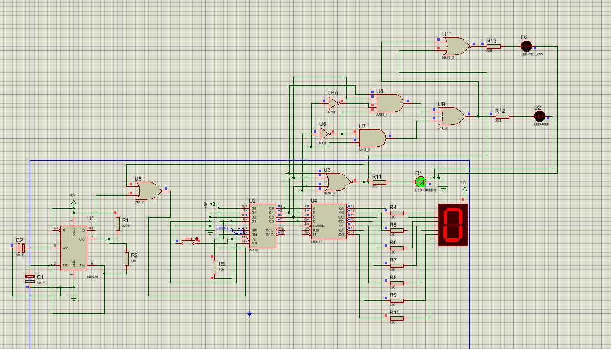 |

### Red Phase
| State | Screenshot |
|---|---|
| Number 7 (Red) | 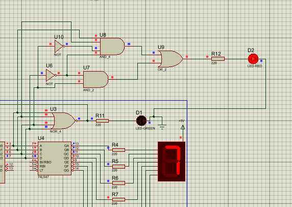 |
| Number 6 (Red) | 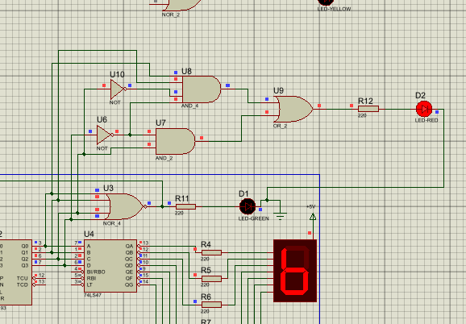 |
| Number 5 (Red) | 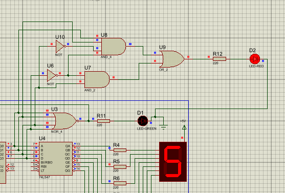 |
| Number 4 (Red) | 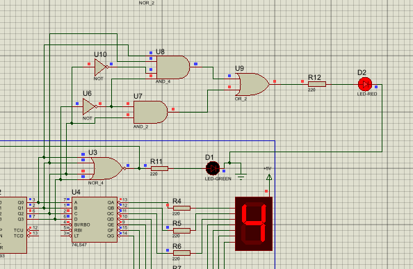 |
| Number 3 (Red) | 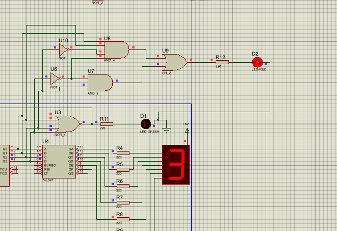 |

### Amber/Yellow Phase
| State | Screenshot |
|---|---|
| Number 9 (Yellow) | 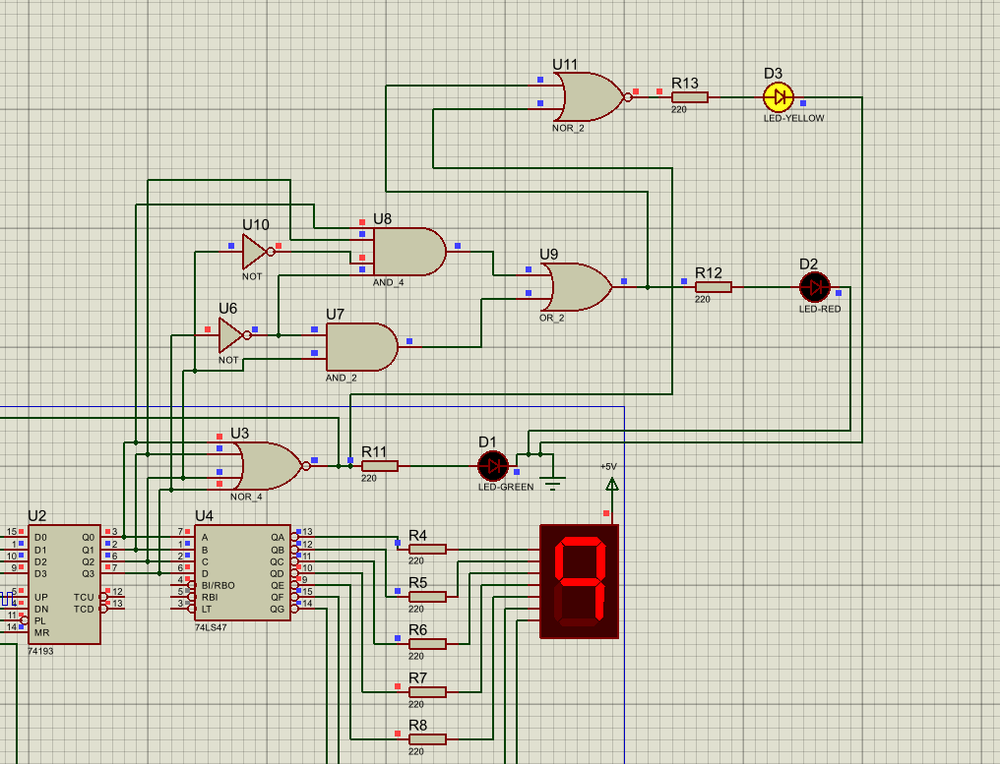 |
| Number 8 (Yellow) | 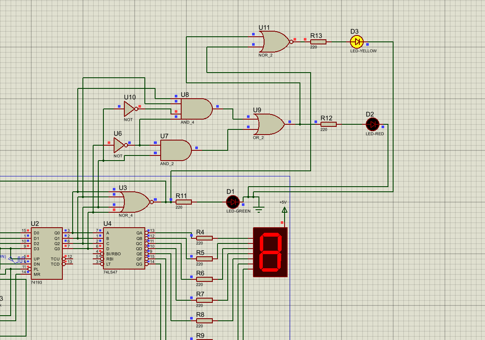 |
| Number 2 (Yellow) | 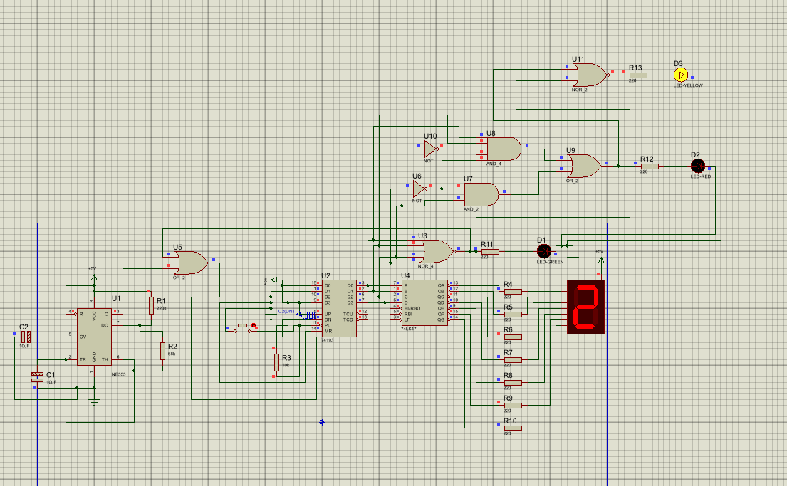 |
| Number 1 (Yellow) | 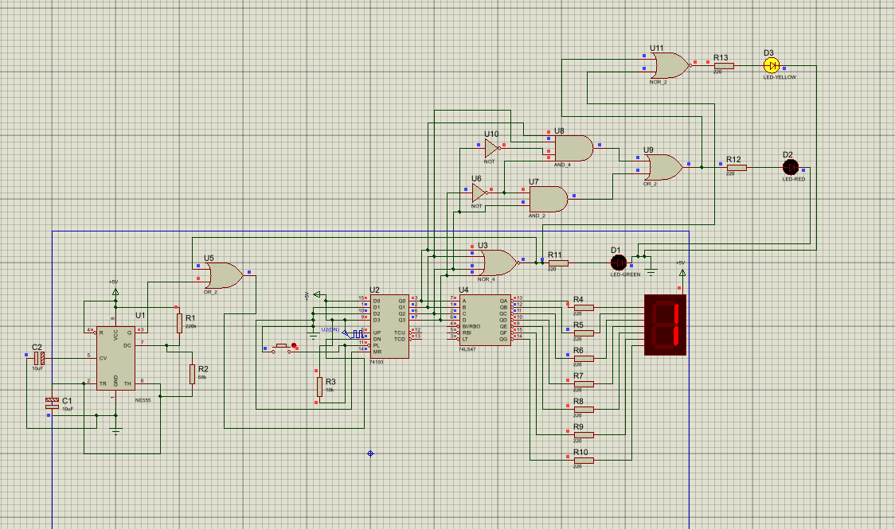 |

### Additional Captures
| File | Screenshot |
|---|---|
| 5 one.png |  |
| 7 one.png |  |
| parts.png | 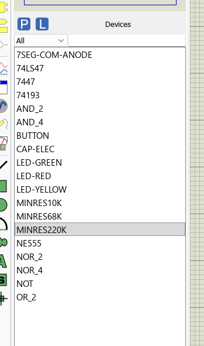 |
| circuit physical front.jpeg |  |
| physical circuit front.jpeg |  |

## Project Files Included
- [Assignment document](Assignment%20(5).docx)
- [Simulation output video](final%20elrctronic%20output.mp4)
- [Proteus circuit archive](circuit%20protues.zip)

## How to Run the Simulation
1. Install **Proteus Design Suite**.
2. Open the project file (`.pdsprj`) in Proteus.
3. Start simulation using the **Play** button.
4. Press the input button/switch to start the countdown sequence.
5. Observe the countdown and traffic light transitions.
